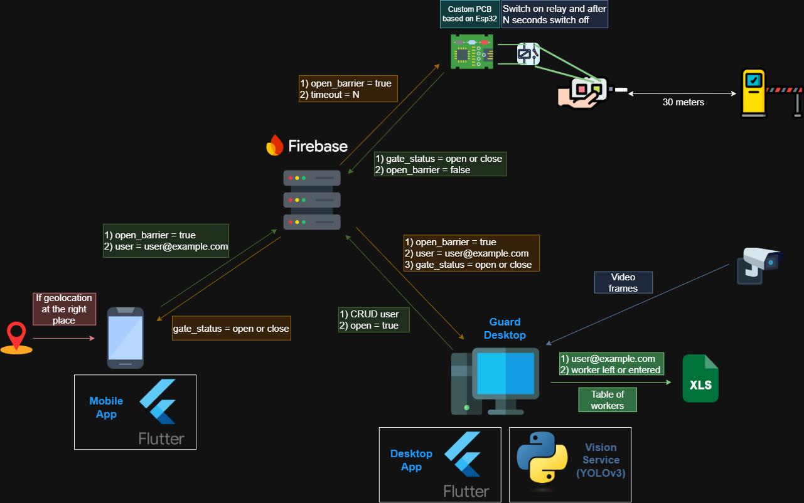
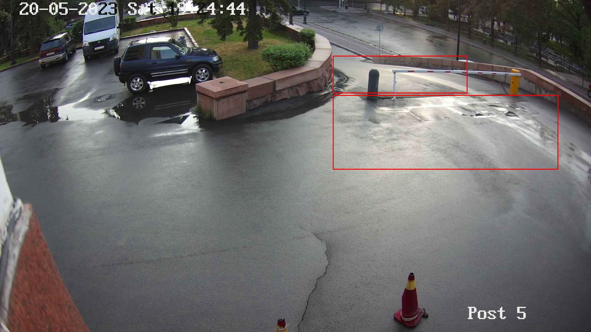
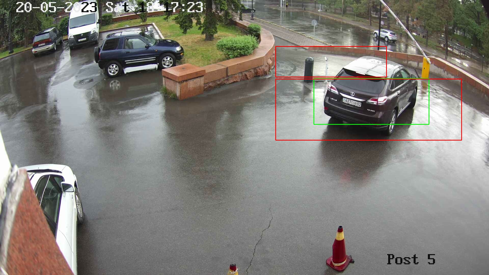
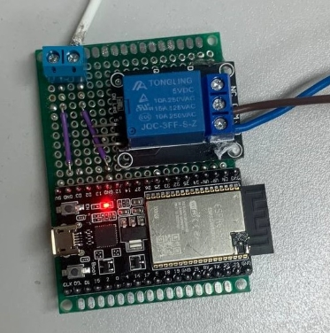
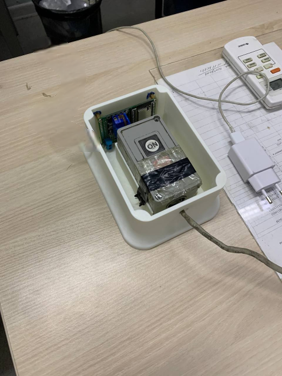

# Smart Parking Access 🚗🔐

A **real-world IoT + Computer Vision system** for automating barrier gate access for university staff. The project replaces lost RF remotes and costly wired LPR cameras with a mobile app, a custom ESP32 PCB module, and an AI vision service.

---

## 📱 Mobile App

Available on Google Play → [**Install here**](https://play.google.com/store/apps/details?id=com.web.kbtu&pcampaignid=web_share)

---

## ⚡ How it works

* **Mobile App (Flutter)**: Checks geolocation, authenticates via Firebase, and sends an `open_barrier` signal.
* **Firebase (RTDB + Auth)**: Stores barrier state, verifies user identity, and forwards commands securely.
* **Custom PCB (ESP32)**: Listens for open commands and switches relay contacts to trigger the gate.
* **Vision Service (YOLOv3)**: Monitors video feed, detects vehicle direction, and logs entry/exit.
* **Guard Desktop (Flutter + Python)**: CRUD for users, live status, and export to XLS.

---

## 🗂️ Project structure

| Folder            | Description                             |
|-------------------|-----------------------------------------|
| `mobile_app/`     | Flutter Android/iOS app                 |
| `desktop_app/`    | Guard Desktop app                       |
| `vision_service/` | Python + YOLOv3 detection               |
| `firmware/`       | ESP32 firmware                          |
| `docs/`           | System Architecture                     |

---

## 🎥 Vision Service In Action

Below are real detection samples showing how the YOLO-based module tracks vehicle movement through the barrier:

|           Empty Gate (ROIs set)           |      Vehicle Detected (Crossing ROI)      |
| :---------------------------------------: | :---------------------------------------: |
|  |  |

This ROI logic ensures the system knows if a car enters or exits the parking area, reducing manual work for security.

---

## 🔌 Hardware Prototype

This project includes a real ESP32-based custom PCB prototype mounted inside the old remote enclosure.  
The module connects its relay in parallel with the original button, so the gate can still be opened manually or via Wi-Fi.

|             PCB Prototype                 |               Enclosure                   |
| :---------------------------------------: | :---------------------------------------: |
|       |          |

**Wiring diagram:** [scheme](docs/hardware/scheme.pdf)

### Bill of Materials

| Part              | Description                               |
|-------------------|-------------------------------------------|
| ESP32-WROVER      | Wi-Fi microcontroller                     |
| Relay Module (5V) | Switches the original gate button circuit |
| 5V Power Supply   | Powers the module safely                  |
| Reused Enclosure  | Old remote casing, adapted for PCB        |

---

## 🔒 Security Notes

* Firebase Auth protects all gate commands (`open_barrier`).
* RTDB rules validate `uid`.
* ESP32 uses secure HTTPS requests.

---

## ✅ Highlights

* Full working deployment: **tested hardware, AI tracking, and mobile app in store**.
* Clear data flow: user → cloud → edge module → gate.

